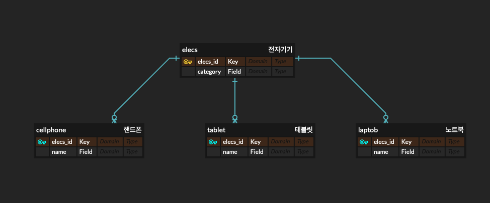

### **\[1장\] JPA 소개**

---

📍 JPA ?

-   객체와 관계형 데이터베이스 간의 차이를 중간에서 해결해주는 ORM(Object Relational Mapping)
-   자바 진영의 ORM 기술 표준.
-   지루하고 반복적인 CRUD SQL을 알아서 처리해줌. + 객체 모델링과 관계형 데이터베이스 사이의 차이점도 해결해줌.
-   JPA를 사용하면, SQL을 직접 작성할 필요가 없음.
-   \--> 어떤 SQL이 실행될 지 생각하기만 하면 됨.
-   JPA 를 사용하면, 애플리케이션을 SQL이 아닌 객체 중심으로 개발하니, 생산성과 유지보수가 좋아지고, 테스트를 작성하는 것도 편리해짐.

📍 1.1 SQL을 직접 다룰 때 발생하는 문제점  ?

-   ex) SELECT ID, NAME, EMAIL FROM MEMBER 로 회원에 대한 정보를 가져오는 테이블이 있었음.
-   그러면 INSERT 할 때도 ID, NAME, EMAIL 을 넣어서 INSERT 했을 텐데, 
-   갑자기 번호도 추가해달라고 하면, 
-   SELECT INSERT UPDATE 등등의 모든 부분에서 TEL 을 넣어줘야하는 아주 귀찮은 일이 발생함.
-   만약, 회원 객체를 DB 가 아닌 자바 컬렉션에 보관했다면, 필드를 추가했다고 해서 많은 SQL을 수정하는 일이 없었을 것임.
-   Member와 같은 비즈니스 요구사항을 모델링한 객체를 엔터티라고 함.
-   SQL에 의존하는 상황해서는 엔터티를 신뢰할 수 없음.
-   하나의 필드를 추가하고 삭제할 때 마다, 그 메소드? 가 어떤 쿼리를 부르고 있는 지를, 하나하나 확인해봐야함.
-   이건 진정한 의미의 계층 분할이 어려움.

📍 JPA 를 사용하면 ?

-   객체를 DB에 저장하고 관리할 때, SQL을 직접 작성하지 않아.
-   JPA가 제공하는 API를 사용하면 됨.
-   그러면 JPA가 개발자를 대신해서 적절한 SQL을 생성해서 DB에 전달함.

-   저장 기능
    -   jpa.persist(member);
    -   persist() 메소드
        -   객체를 DB에 저장함.
        -   이 메소드를 호출하면, JPA가 객체와 매핑정보를 보고 적절한 INSERT SQL을 생성해서 DB 에 전달함.
-   조회 기능
    -   Member member = jpa.find(Member.class, id);
    -   find() 메소드
        -   객체 하나를 DB에서 조회함.
        -   JPA는 객체와 매핑정보를 보고 적절한 SELECT SQL 을 생성해서 DB에 전달하고 그 결과로 Member 객체를 생성해서 반환함.
-   수정 기능
    -   Member member = jpa.find(Member.class, id);
    -   member.setName("이름변경");
    -   자세한 내용은 3장.
-   연관된 객체 조회
    -   Member member = jpa.find(Member.class, id);
    -   Team team = member.getTeam(); // 연관된 객체 조회
        -   JPA는 연관된 객체를 사용하는 시점에 적절한 SELECT SQL을 실행함.
        -   자세한 내용은 8장.

📍 패러다임의 불일치 ?

-   원래 하던 방식 : 객체를 만들어서, 인스턴스를 만들어서 그 안에 값들을 넣었음.
-   ex) 

```
Class Member{
	String id;
    String name;
    String email;
    String tel;
	
    . . .
    각각의 
    getter 
    setter 
	. . .
    
}
```

-   값을 불러서 쓸 때, 
-   Member member;
-   member.getId();
-   member.setId("dkdlel");
-   이런 식으로 불러서 쓰고, 불러서 set 해서 썼음. 
-   가장 마지막에는 SQL Mapper 로 INSERT INTO MEMBER (ID, NAME, EMAIL, TEL) VALUES('gloria', '글로리아', 'gloria94682015@tistory.com', '010123456789');
-   이런 식으로 결국 가장 마지막에는 RDBMS 로 값을 DB에 넣어줬음.
-   RDBMS는 데이터 중심으로 구조화되어 있고, 집합적인 사고를 요구함. + 객체지향에 있는 추상화, 상속, 다형성 같은 개념이 없음.

📍 JDBC 방식 vs JPA 방식 ?



-   이렇게 RDBMS가 있다면, 
-   JDBC 의 경우,
-   CELLPHONE 가 ELECS 의 상속관계라고 한다면,
-   INSERT INTO ELECS 를 하고 INSERT INTO CELLPHONE  을 해서 상속관계에 있는 이 두 객체를 DB 에 저장해야함.
-   그리고 값을 SELECT 할 때는,
-   SELECT E.\*, C.\* FROM ELECS E, CELLPHONE C ON E.ELECS\_ID = C.ELECS\_ID; 로
-   조인을 해서 SELECT문을 불러야함.

-   JPA 의 경우,
-   INSERT
    -   jpa.persist(cellphone);
-   SELECT
    -   String elecs\_id = '0001';
    -   Cellphone cellphone = jpa.find(cellphone.class, elecs\_id);
    -   JDBC에서 했던, 조인해서 select 해주는 과정을 알아서 해줌.

📍 연관관계 ?

-   객체는 참조를 사용해서, 다른 객체와 연관관계를 가지고 참조에 접근해서 연관된 객체를 조회함.
    -   A ➡️ B 라면,
    -   A.get~() 은 가능하지만, B.get~() 은 불가능함.
    
-   테이블은 외래키를 사용해서 다른 테이블 과의 연관관계를 이룸.
-   그래서 JDBC를 사용할 때는, 참조를 이용하는 객체 와 외래키를 이용하는 테이블 사이를 개발자가 중간에서 변환하는 역할을 해줘야 했다.

---

[개발 공부를 위한 블로그](https://gloria94682015.tistory.com/74) 입니다. 

오류가 있다면 댓글로 알려주세요! 

감사합니다.

