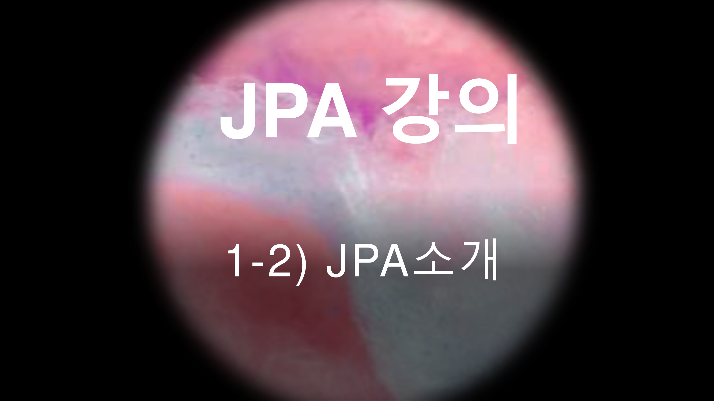
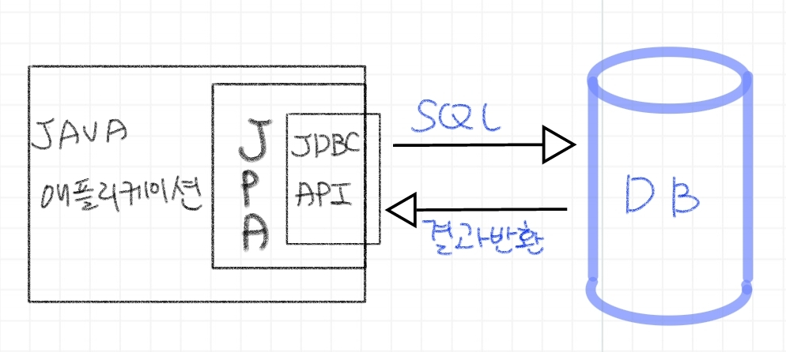
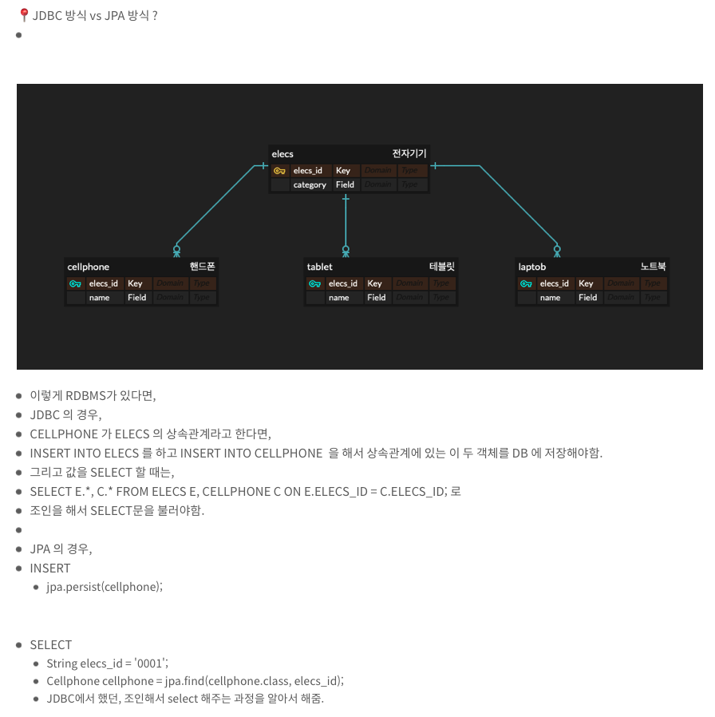

# [JPA강의] 1-2) JPA 소개



---

📍 JPA ?

-   Java Persistence API
-   자바 진영의 ORM 기술 표준
    -   ORM?
        -   Object-relational mapping(객체 관계 매핑)
        -   객체는 객체대로 설계
        -   관계형 데이터베이스는 관계형 데이터베이스대로 설계
        -   ORM 프레임워크가 중간에서 매핑
        -   대중적인 언어에는 대부분 ORM 기술이 존재함.
        
-   JPA 는 표준명세
-   JPA 는 인터페이스의 모음.

-   JPA는 애플리케이션과 JDBC 사이에서 동작함.




-   JPA의 역사?
    -     **"EJB (엔티티 빈 (자바표준))"**   에서 시작 --> 누군가가 불편해서 만든 것이    **"하이버네이트"**    (이건 오픈소스.) --> 이 하이버네이트를 보다 다듬어서 만든 것이 현재의   **"JPA"**  

📍 JPA를 왜 사용해야 하는 지 ?

-   1\. SQL 중심적인 개발 -> 객체 중심으로 개발
-   2\. 생산성 \_ JPA와 CRUD 
    -   저장 : jpa.persist(member);
    -   조회 : Member member = jpa.find(memberId);
    -   수정 : member.setName("변경할 이름");
    -   삭제 : jpa.remove(member);
    -   JPA가 자바 컬렉션을 이용하는 것 같이. 그 과정을 다 해주고, DB에 저장해주는 일을 함.
-   3\. 유지보수 
    -   만약 컬럼이 추가 된다면,
    -   기존 JDBC의 경우,

```
public Class Member{

    String id;
    String name;
    String email;
}

Insert문
INSERT INTO MEMBER (ID, NAME, EMAIL) 
VALUES('gloria', '글로리아', 'gloria94682015@tistory.com');

SELECT문
SELECT ID, NAME, EMAIL
FROM MEMBER;
```

오픈 직전에 TEL을 넣어달라고 하면?

```
public Class Member{
	
    String id;
    String name;
    String email;
    // 오픈 직전에 tel 을 추가 해달라고 하면?
    String tel;
}

Insert문
INSERT INTO MEMBER (ID, NAME, EMAIL, TEL) 
VALUES('gloria', '글로리아', 'gloria94682015@tistory.com', '010123456789');

SELECT문
SELECT ID, NAME, EMAIL, TEL 
FROM MEMBER;
```

-    
    -   오픈 직전에 TEL이 들어가야하는 모든 쿼리를 전부 다 수정해줘야함.
    
    -   JPA 의 경우

```
public Class Member{
    private String id;
    private String email;
    // 오픈 직전에 tel 을 추가 해달라고 하면?
    private String tel; // 그냥 필드만 추가해주면 됨.,
}
```

-     
    -   이렇게 필드만 추가하면 됨, SQL 은 JPA 가 알아서 처리해준다.
-   4\. 패러다임의 불일치 해결
    -   JPA와 상속 




-    
    -    [예습하면서 블로깅 했음.](https://gloria94682015.tistory.com/74)
    -   JPA 가 알아서   **INSERT INTO ELECS**   와   **INSERT INTO CELLPHONE**   으로 나눠서 쿼리를 돌림.
-    
    -   JPA와 연관관계

```
//JPA와 연관관계
member.setTeam(team);
jpa.persist(member);
```

-    
    -   JPA와 객체 그래프 탐색

```
//JPA와 객체 그래프 탐색
Member member = jpa.find(Member.class, memberId);
Team team = member.getTeam();
```

-    
    -   엔티티를 신뢰할 수 있다.
        -   이유 : JPA 는   **"지연로딩"**    이라는 기능이 있음.
        -   member.getTeam() 이나 member.getOrder().getDelivery() 를 해서 
        -   실제로 이 객체를 조회해서 사용하는 시점에 쿼리가 돌아서 객체에 채워짐.

```
// JPA 를 사용하면, 엔티티를 신뢰할 수 있음.
class MemberService {
	public void process(){
    	Member member = memberDAO.find(memberId);
        member.getTeam(); // 자유롭게 객체 그래프를 탐색할 수 있음.
        member.getOrder().getDelivery();
    }
}
```

-       
    -   JPA와 비교하기
        -   동일한 트랜잭션에서 조회한 엔티티는 같음을 보장해줌.

-   6\. 성능 최적화 기능
    -   1) 1차 캐시와 동일성 보장
        -   1️⃣  같은 트랜잭션 안에서는 같은 엔티티를 반환함. --> ( 약간의 조회 성능 향상 )
        -   2️⃣  DB Isolation Level 이 Read Commit 이어도 애플리케이션에서 Repeatable Read  보장.  
            -   뭔가 되게 이해하기 어려워서,,, 일단, 건너뜀. ㅎㅎ;;...

```
String memberId = "100";
Member m1 = jpa.find(Member.class, memberId); // SQL
Member m2 = jpa.find(Member.class, memberId); // 캐시

// m1 == m2

// SQL 을 1번만 실행함.
```

-       이 때의 캐시는, 기존에 알고 있던 캐시와는 좀 다름.
    -   한 트랜젝션의 시작 ~ 끝 사이에의 동일성을 보장하는 것으로, 아주 짧은 캐시 처리.
    
    -   2) 트랜잭션을 지원하는 쓰기 지연 - INSERT
        -   1️⃣ 트랜잭션을 커밋할 때까지 INSERT SQL 을 모음.
        -   2️⃣ JDBC BATCH SQL 기능을 사용해서 한번에 SQL 전송.
        -   옵션 하나만 켜주게 되면, 편하게 가능.

```
transaction.begin(); // 트랜젝션 시작.

em.persist(memberA);
em.persist(memberB);
em.persist(memberC);
//persist로 저장을 한다고 해도, 바로 INSERT SQL 을 DB에 보내지 않음.

// 커밋을 하는 순간, 쌓아두었던 INSERT SQL을 DB에 모아서 보냄.
transaction.commit(); // 트랜젝션 커밋.
```

-   -   2) 트랜잭션을 지원하는 쓰기 지연 - UPDATE
        -   1️⃣ UPDATE, DELETE 로 인한  로우(ROW)락 시간 최소화
        -   2️⃣ 트랜젝션 커밋 시 UPDATE, DELETE SQL 실행하고, 바로 커밋.
        -   LOCK ?
            -   데이터의 일관성을 보장하기 위한 방법.
        -   ROW LOCK ? 
            -   행 수준의 락은 1개의 행을 기준으로 락 설정을 함.
            -   DML에 대한 락으로 가장 일반적으로 사용하는 락이라고 함.

```
transaction.begin(); // 트랜젝션 시작.

changeMember(memberA);
deleteMember(memberB);
비즈니스 로직 수행(); // 비즈니스 로직 수행 동안 DB 로우 락이 걸리지 않음.
//persist로 저장을 한다고 해도, 바로 INSERT SQL 을 DB에 보내지 않음.

// 커밋을 하는 순간, 쌓아두었던 UPDATE, DELETE SQL을 DB에 모아서 보냄.
transaction.commit(); // 트랜젝션 커밋.
```

-    
    -   3) 지연로딩
        -   지연 로딩 : 객체가 실제 사용될 때 로딩.
        -   즉시 로딩 : JOIN SQL 로 한번에 연관된 객체까지 미리 조회.
        -   JPA 에 옵션이 있음. 멤버를 가져올 때, 대부분 팀을 가져온다고 하면 즉시 로딩이 유리하니까, 
        -   옵선을 주면 됨.

```
// 지연로딩
Member member = memberDAO.find(memberId); // select * from member
Team team = member.getTeam();
String teamName = team.getName(); // select * from team


// 즉시 로딩
Member member = memberDAO.find(memberId); // select m.*, t.* from member join team on m.teamId = t.id
Team team = member.getTeam();
String teamName = team.getName();
```

-   7\. 데이터 접근 추상화와 벤더 독립성
-   8\. 표준


<br>
<br>


---

[개발 공부를 위한 블로그](https://gloria94682015.tistory.com/76) 입니다. 

오류가 있다면 댓글로 알려주세요! 

감사합니다.

