# [JPA강의] 2-1) Hello JPA - 프로젝트 생성

---

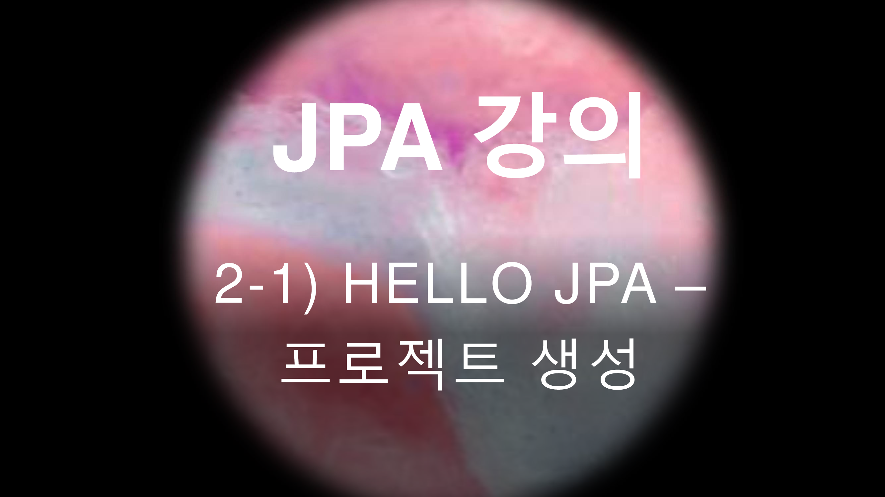

---

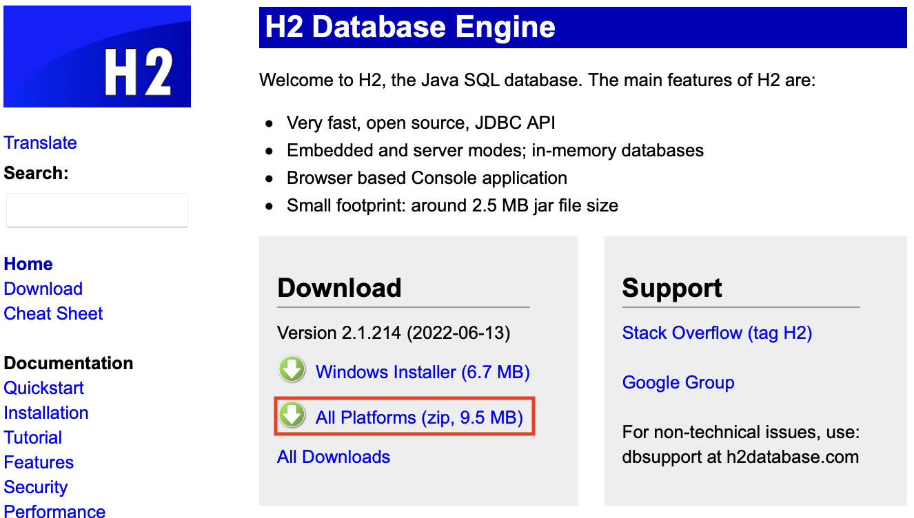

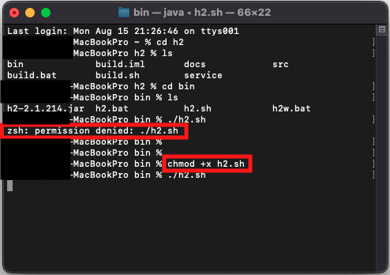

연결할 수 없다고 하면서 안 뜸..

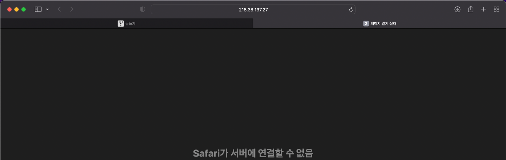

[인프런 Q&A](https://www.inflearn.com/questions/211243)

url 을 수정해주면 됨.

즉, 저 218.38.137.27 을 localhost 로 바꾸면 됨.

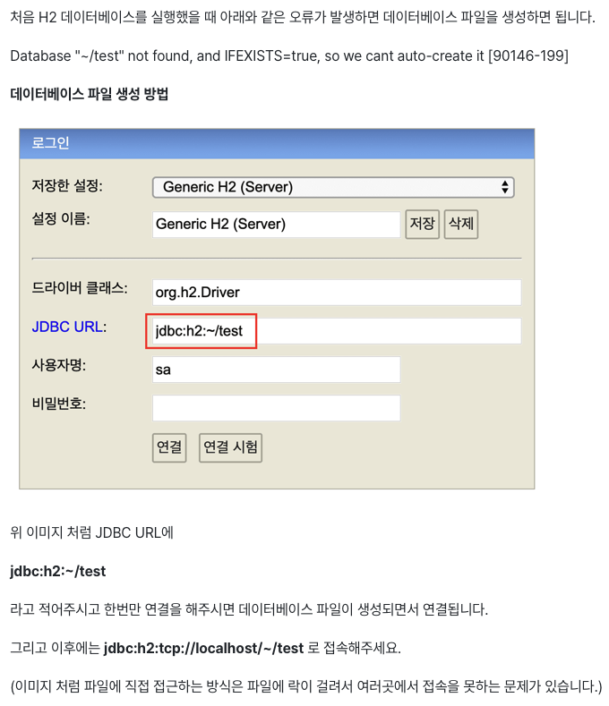

-   프로젝트는 메이븐에 인텔리제이로 한다고 함.
-   나는 일단,, 인텔리제이가 없기 때문에 깔고 와야함. 설치하는 과정이 아주 간단함.
-   [인텔리제이 설치 과정](https://gloria94682015.tistory.com/77)

김영한 선생님이 하는 거랑 쫌 다르게 생겨서 일단 

File -> new -> project 로 해서 만들었음.

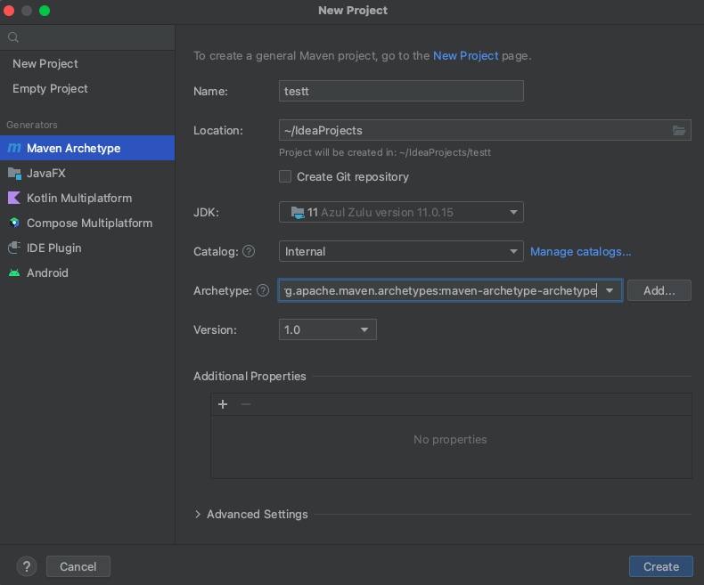

pom.xml 에 dependences 를 넣기 전에!

버전 확인하고!

[https://spring.io/projects/spring-boot](https://spring.io/projects/spring-boot)

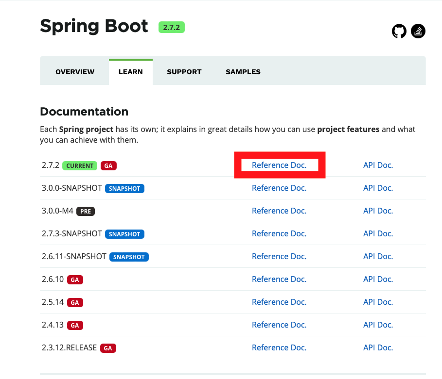

 

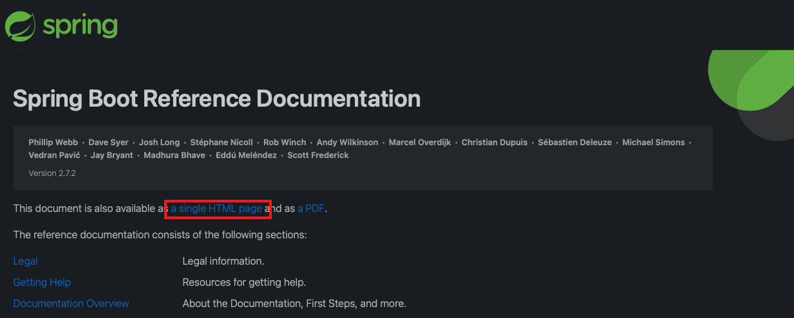

 

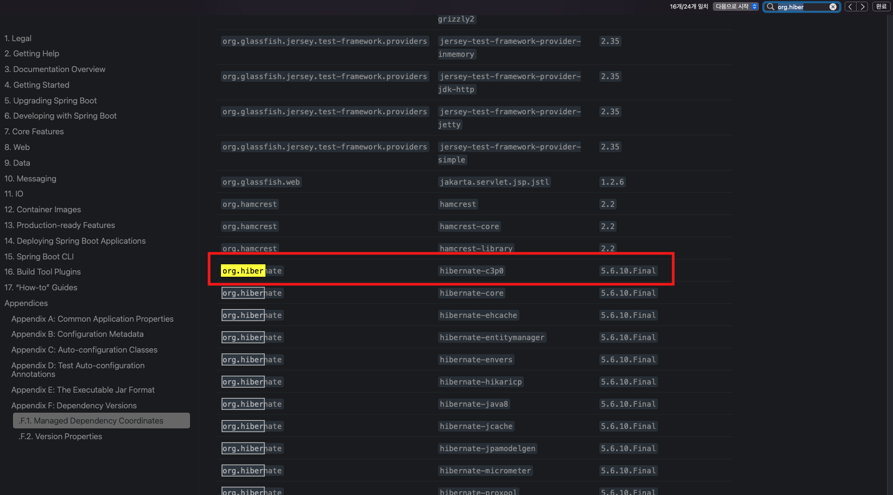

 
 

부트 : 2.7.2 

하이버네이트 : 5.6.10.Final

H2 데이터베이스 : 2.1.214

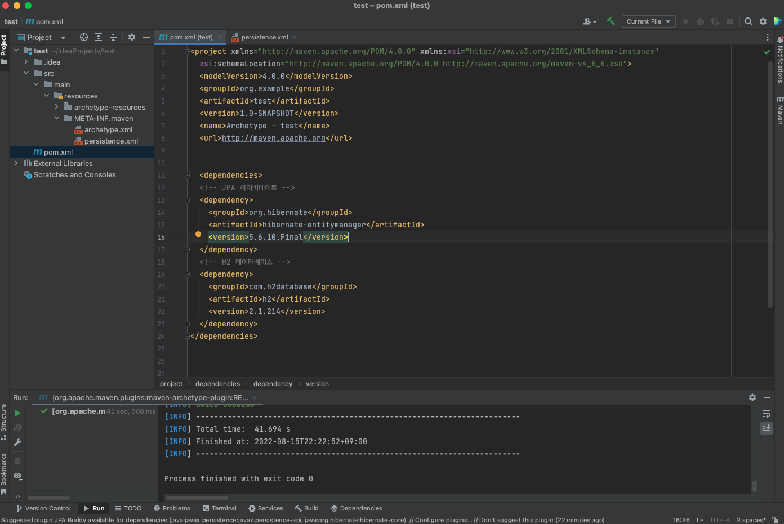

JPA persistence.xml 은 위치가 아주 중요함.

 
 
src/main/resources/META-INF/persistence.xml 로 만들어야함. 

 

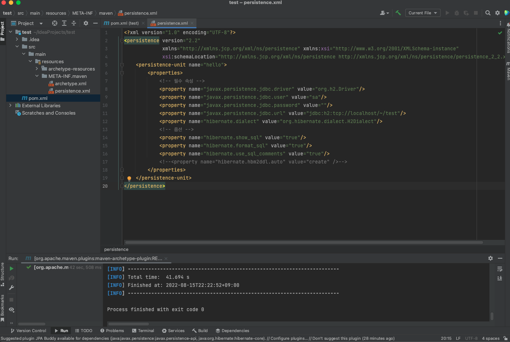

다음에 이어서...

---

[개발 공부를 위한 블로그](https://gloria94682015.tistory.com/78) 입니다. 

오류가 있다면 댓글로 알려주세요! 

감사합니다.

