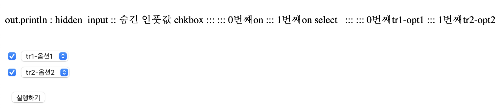

# [jQuery] form.serialize 로 데이터 넘겨서 서버에서 받기

<br>
<br>

---

<br>


```
<%@ page language="java" contentType="text/html; charset=UTF-8" pageEncoding="UTF-8" %>
<!DOCTYPE html PUBLIC "-//W3C//DTD HTML 4.01 Transitional//EN" "http://www.w3.org/TR/html4/loose.dtd">
 
<p>
	out.println : <span id="test_val"></span>
</p>
 
<form>
	<input type="hidden" value="숨긴 인풋값" name="hidden_input"/>
	
	<table>
		<tbody>
			<tr style="border:1px solid gray;">
				<td><input type="checkbox" name="chkbox"></td>
				<td>
					<select name="select_">
						<option value="tr1-opt1">tr1-옵션1</option>
						<option value="tr1-opt2">tr1-옵션2</option>
					</select>
				</td>
			</tr>
			<tr style="border:1px solid gray;">
				<td><input type="checkbox" name="chkbox"></td>
				<td>
					<select name="select_">
						<option value="tr2-opt1">tr2-옵션1</option>
						<option value="tr2-opt2">tr2-옵션2</option>
					</select>
				</td>
			</tr>
		</tbody>
	</table>
</form>
 
<input type="button" value="실행하기" id="btn_do"/>
  
<script src="//code.jquery.com/jquery-1.11.0.min.js"></script>
 
<script>    
	$('#btn_do').click(function(){        
		$.ajax({            
			url:'testServer.jsp', //통신할 서버 페이지            
			type:'post', //기본형식은 get post면 따로 써주기            
			//form에 잇는 데이터를 name:value 값으로 매칭시켜보내줌            
			data:$('form').serialize(),             
			success:function(data){                
				$('#test_val').text(data); //받아온 data 실행            
			}        
		})    
	})
</script>
```

```
<%@ page language="java" contentType="text/html; charset=UTF-8" pageEncoding="UTF-8" %>


<%
//test.jsp 에서 보낸 parameter 받기
String hidden_input = request.getParameter("hidden_input");

String chkbox = "";
String select_ = "";
for(int i=0; i<2; i++){
	chkbox = chkbox + " ::: " + i + "번째" + request.getParameterValues("chkbox")[i];
	select_ = select_ + " ::: " + i + "번째" +  request.getParameterValues("select_")[i];
	
}


//test.jsp 에 다시 보내줄 값
out.clearBuffer(); // 앞에 있는 모든 내용을 clear 시킴.
out.println("hidden_input :: " + hidden_input);
out.println(" chkbox  ::: " + chkbox );
out.println("select_  :::  " + select_);
%>
```



📍 ?

-   ㅇㅇ

---

참고 사이트 : [참고사이트](https://joohee46.tistory.com/7)

<br>
<br>

---

<br>

[개발 공부를 위한 블로그](https://gloria94682015.tistory.com/80) 입니다. 

오류가 있다면 댓글로 알려주세요! 

감사합니다.

