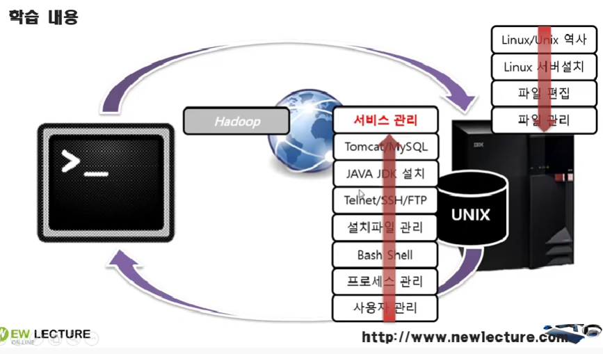

# 1강. 2강. 3강 (튜토리얼)

> ## 1. 왜 우리는 리눅스를 배워야 하는가
---

.  
- 운영체제에 따라서 다루는 소프트웨어가 다르기 때문.  
--> 리눅스 : IDE, 오픈소스API, WAS, Web Server  
--> 윈도우 : 워드, 게임 등등    
 

---
> ## 2. 어떤 리눅스를 배워야하는가?
---
.  
- 우분투
---
> ## 3. 개발자가 알아야할 리눅스의 필수 내용
---
.  
- 원격 <-> unix 
- 터미널을 이용해서 원격으로 시스템을 관리하는 역량은 가지고 있어야함.
- Linux 는 원격으로 관리하는 경우가 많아서. 터미널로 관리하는 역량까지는 가져야함.

