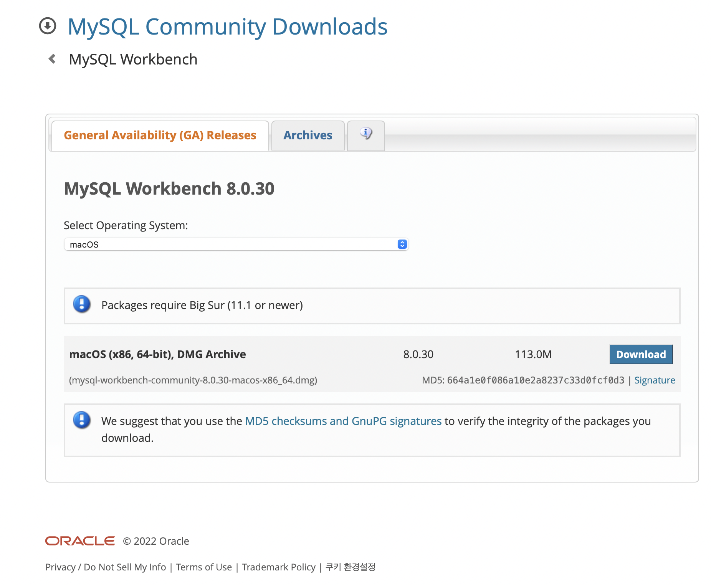
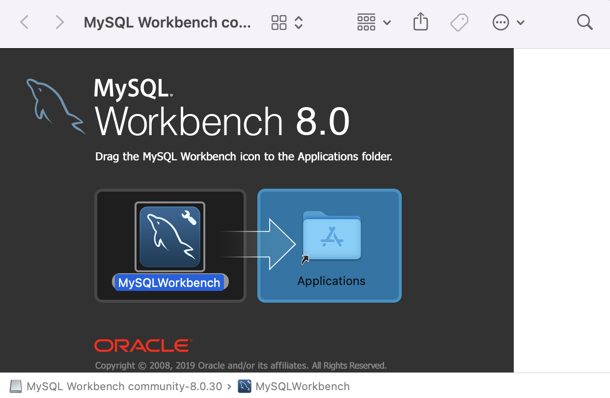
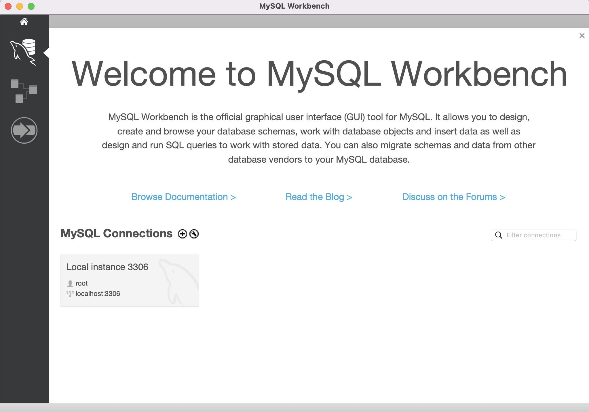
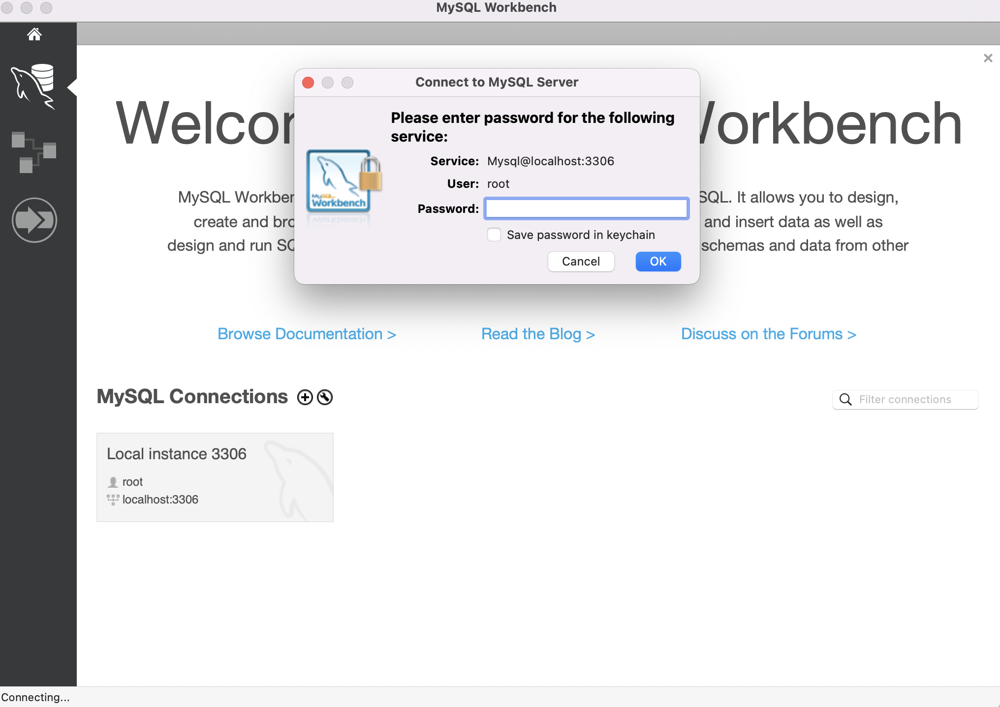
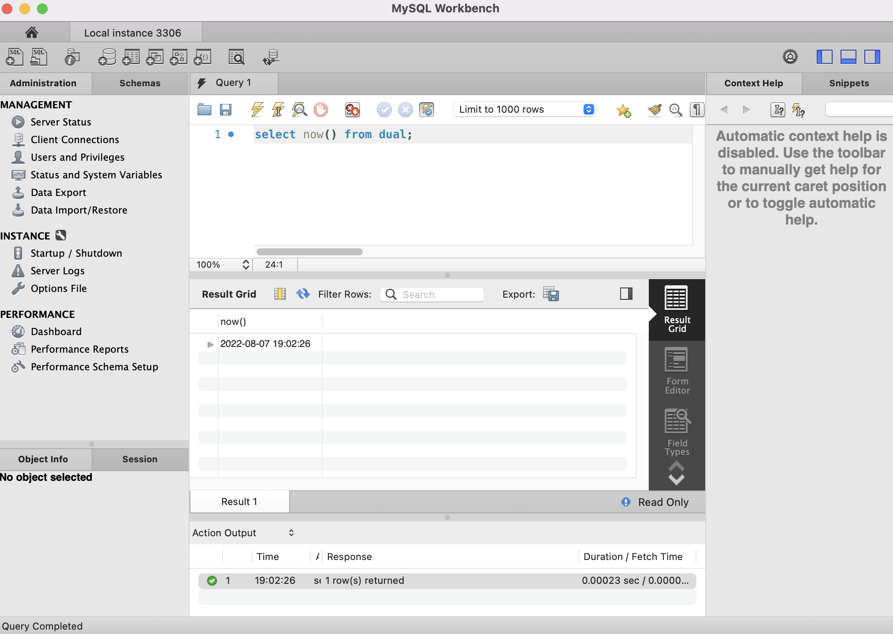

### [맥북 m1] mysql workbench 설치 과정
#
#

mysql  설치 과정

(아주 감사하게도 ... ㅜㅡㅜ 글이 있었음 ㅠㅠ)

[mac m1 에 mysql 설치 하는 과정](https://velog.io/@sorzzzzy/MySQL-Mac-에서-MySQL-설치-및-초기-설정하기-SequelPro-nightly-version-설치)

[mysql WorkBench 설치 공식 홈페이지](https://dev.mysql.com/downloads/workbench/)

mysql workbench 버전은 8.0.30

 
 

root 의 비밀번호는

처음에 homebrew로 깔 때, 설정했던 비밀번호.

잘 되는 구만!! ✌️✌️

 
 

---

[개발 공부를 위한 블로그](https://gloria94682015.tistory.com/72) 입니다. 

오류가 있다면 댓글로 알려주세요! 

감사합니다.

