### [맥북 M1 개발환경 셋팅] 이클립스, 스프링 레거시 프로젝트, 스프링 mvc 프로젝트
#
#

<link rel="stylesheet" type="text/css" href="../mycss.css">

맥북이 사고 싶어서 샀는데.. 개발환경 셋팅 하기 너무 힘들었다...     
거의 한... 3주? 동안 계속 찾아보고... 맥북을 쓰지 말아야하나 까지... ㅠㅠㅠㅠ   
왜 나만 안되는 거냐고.. ㅠㅠ

#
 
이 기록은. 나를 위함. + 나 같이 힘들 사람들을 위함.
 
목차:
1. 이클립스
2. 톰캣
3. 스프링
4. 스프링 mvc 가 뜨는 지.
5. test 프로젝트를 만들고 나서 Hello World 가 뜨는 지.
 #

설명 : 
1. 이클립스 : 2022-03 으로 다운.
 
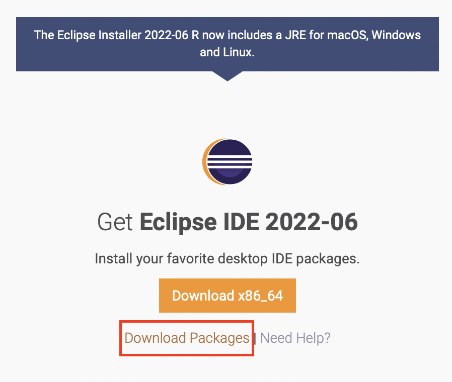
 
 > [이클립스 2022-03 링크](https://www.eclipse.org/downloads/packages/release/2022-03/r)
  

 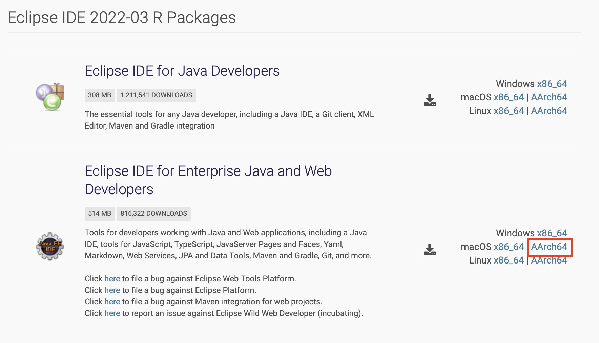

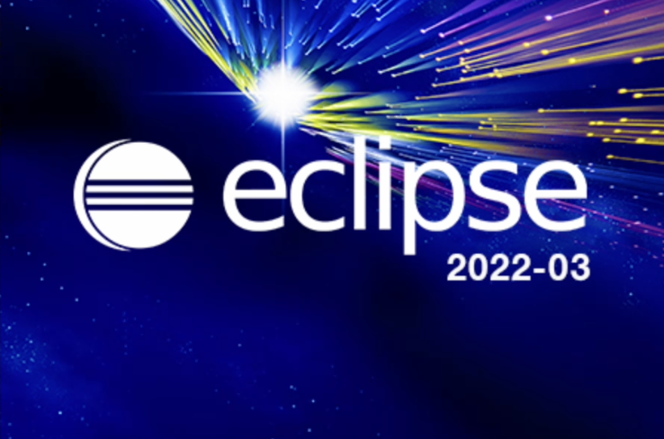
 
 
 

2. 톰캣 버전 : 9.0.65   
( 참고로, 새로운 버전 쓰고 싶어서 10 버전으로 받았었는데... 새로운 버전을 하고 싶다는 거 때문에,,, 몇 주동안 안 됬음.. )    
그러다가 열심히 구글링 해봤는데, m1 에서 10버전이 안 되길래 9버전으로 받았더니 됬다는 사람이 있었네??   
그래서 바로 나도 9로 다운 받아서 해봄.

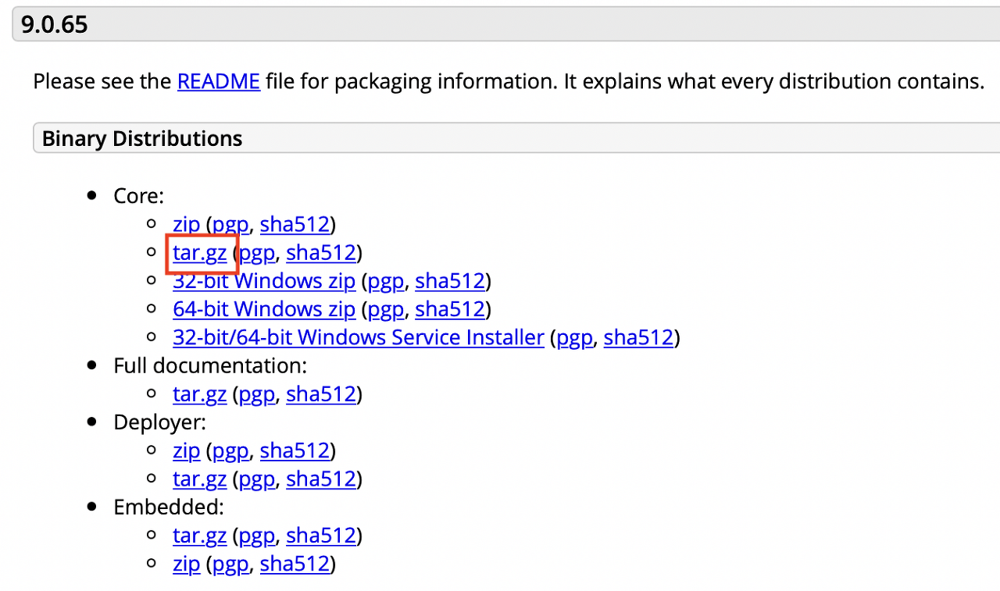

> [톰캣 9 링크](https://tomcat.apache.org/download-90.cgi)

 
 

3. 스프링
이클립스 들어가서, 상단 바에서 help ->  eclipse marketplace 들어가서 spring 검색.   
spring tools 3 으로 install.

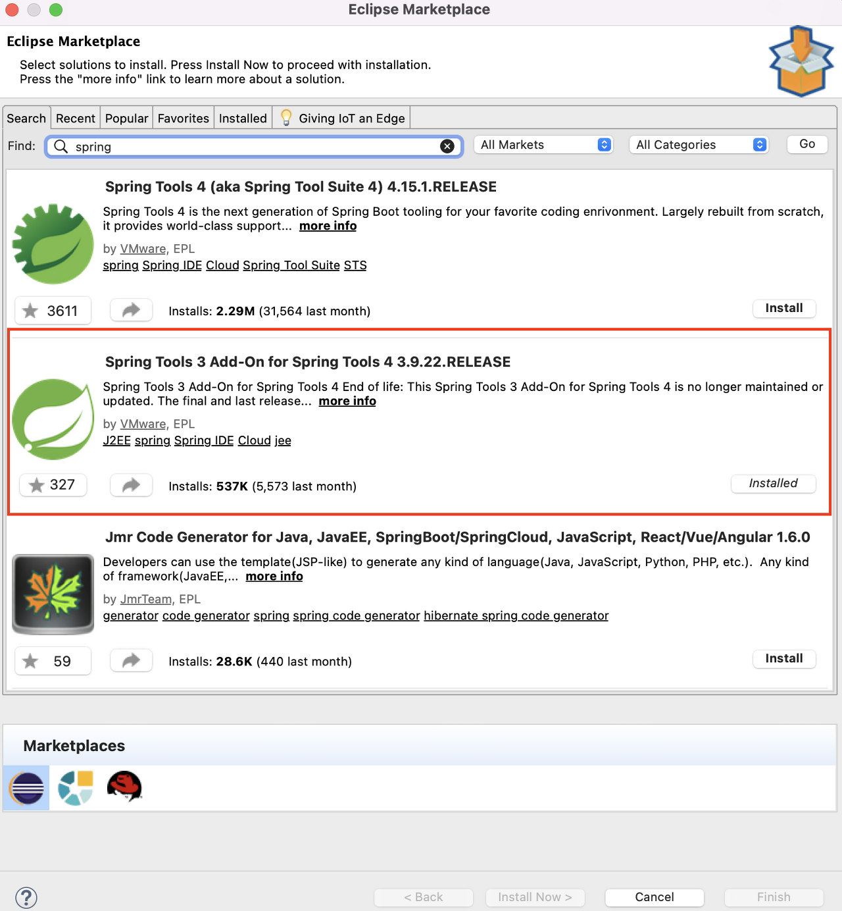

4. 스프링 mvc 가 뜨는 지.   
이클립스 상단 바에서 file -> new -> other -> spring -> spring legacy project    

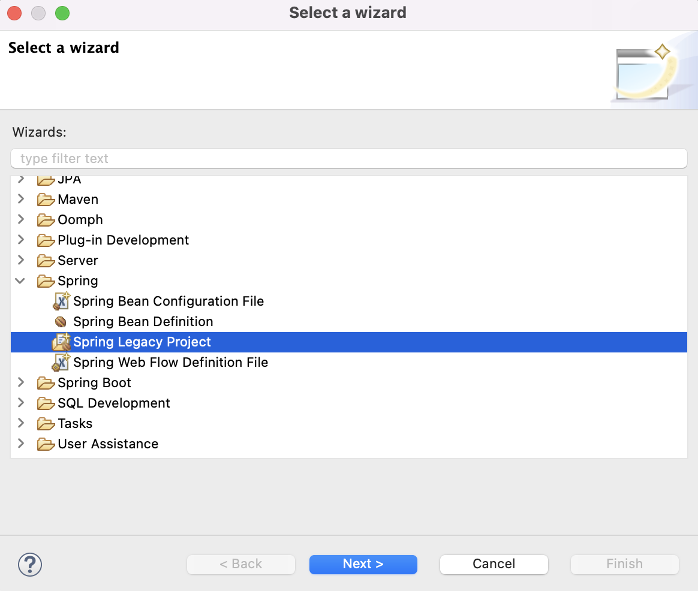

여기서 만약에!!,    
spring 이 안뜬다!?  
그러면 --> 마켓에 가서 spring 을 다시 깔아보면 될 듯.!  
중간에 캡처를 못했는데, 뭔가 그... selected trust ? 같은 거가 떴던 것 같은데...     
(몇번의 실패과정을 겪으면서 될 지 모르고, 캡쳐도 안했음... ㅎㅎㅎ...)   
 
 
내가 이 글을 쓰게 된 가장 큰 이유...    
 뉴 스프링 레거시 프로젝트 하면 원래 밑의 그림과 같은 spring mvc project 가 떠야하는데...   
나는 simple project 만 뜨고 밑에 있는 것들이 안 떴음... ㅠㅠ    
몇번을 지웠다가 깔았다를 반복했는데도 안 떴었음.. ㅠㅠㅠㅠ  
근데, 이클립스 버전 낮추고, 톰캣 버전 낮추니까, 갑자기 되네...?     
 

 &nbsp;&nbsp; 이왜진? &nbsp;&nbsp;
 

  

 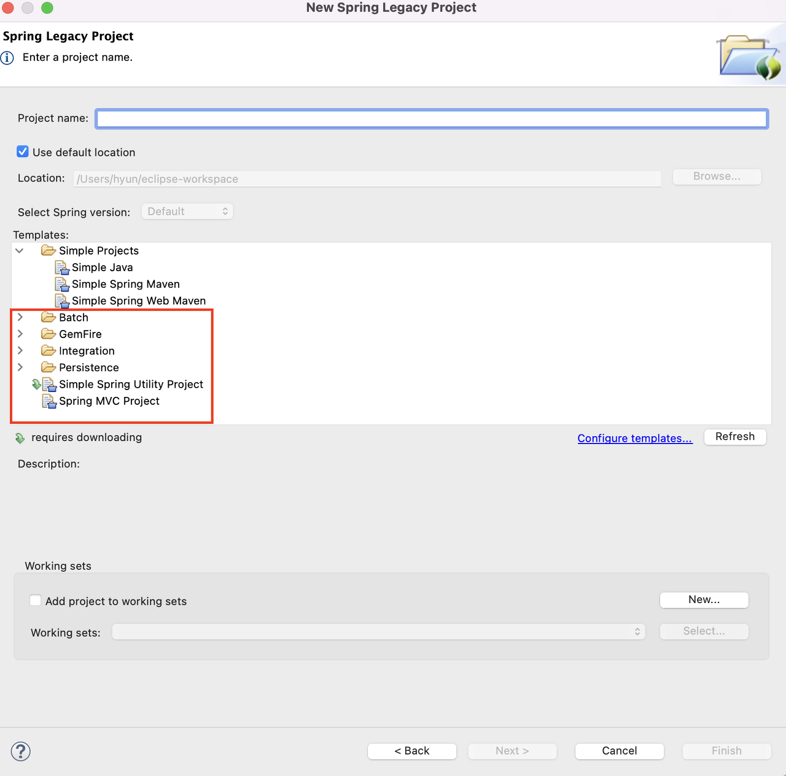

 갑자기 되니까 좋기는 한데... 좀 당황스러웠당.. ㅎㅎ..;;
    
참고로 jdk 버전은 11..    
오라클에서 다운 받는 거가 안되더라.. ㅠㅠ   
그래서 open jdk 로 구글링해서 다운 받았음.

 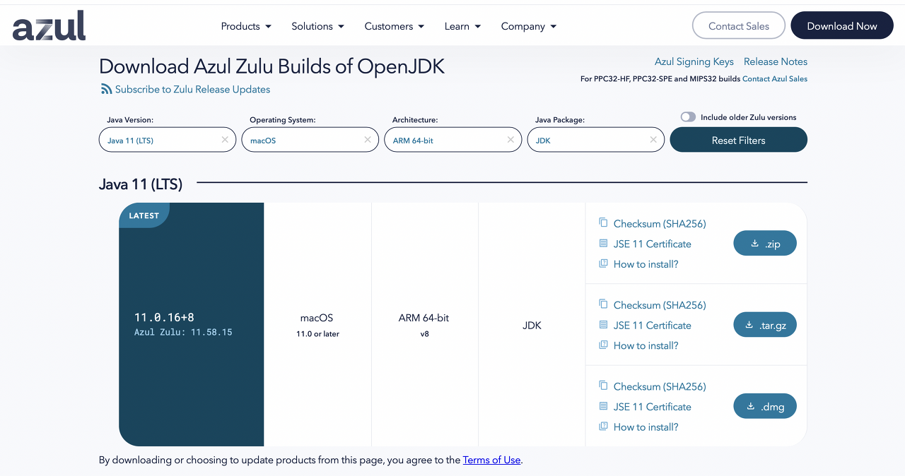

만약에, 톰캣을 돌리는데 오류가 난다?    
---> 이클립스 ini 들어가서 vm 을 바꿔줘보도록한다   
그냥 될 수 도 있음!     
안 되면 들어가서 바꾸면 됨 !.!  

 

 #

 (아 물론!, 이클립스 상단바 -> eclipse -> preferences -> jre검색 -> installed JREs -> 다운받은 jdk 선택. )      
(만약에 없으면, add 눌러서 다운 받은 jdk의 경로를 찾아서 넣으면 추가 하면 됨.)  
(이거 까지 했는데도 톰캣 돌리다가 오류가 나면!  
그때, eclipse.ini 들어가서 vm 을 바꾸면 됨! )

 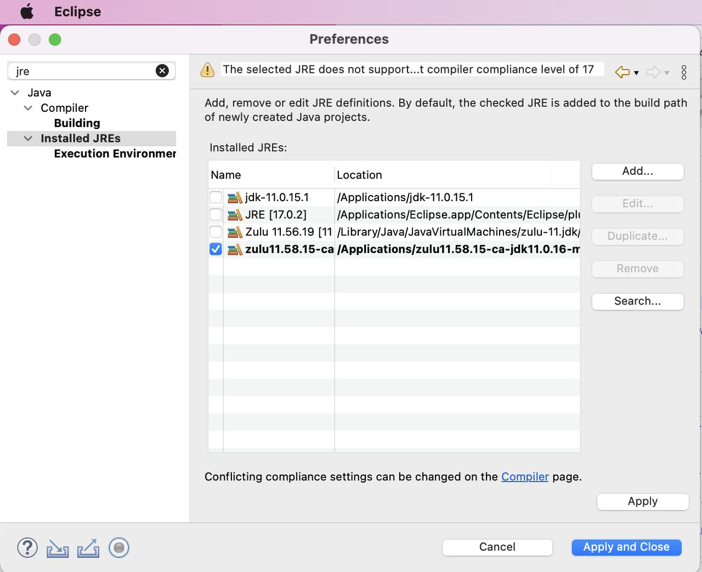

#

 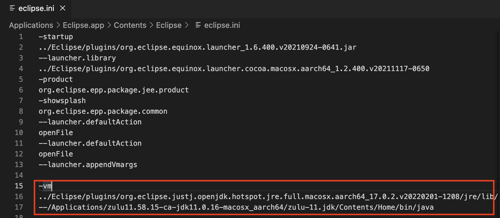

 
그렇게 해서 돌리면??!!

 

 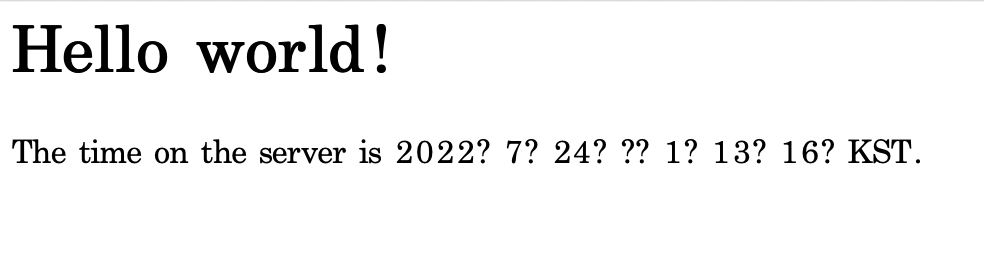

 

하... hello world!!!!!!!!!!!

정말... 이 "헬로우 월드" 하나 보기까지 오래걸렷다 진쨔.. ㅠㅠㅠ

 
 

#
#
> 참고 :    
[자바 버전 알려주신 분.](https://iagreebut.tistory.com/169)     
 
 
[버전차이 때문에 안되는 것 같아서 알아봤을 때, 이클립스 버전과 jdk 버전에 대해 알아봤음.](https://codevang.tistory.com/86)

#
#
[나의 블로그](https://gloria94682015.tistory.com/64)